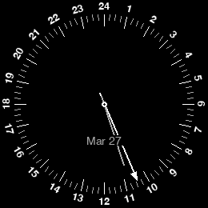
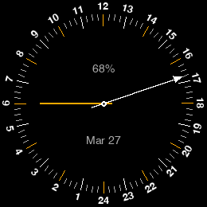
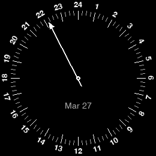
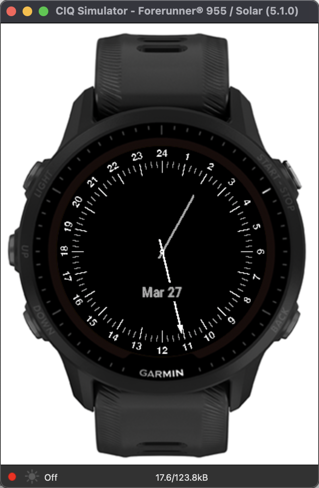
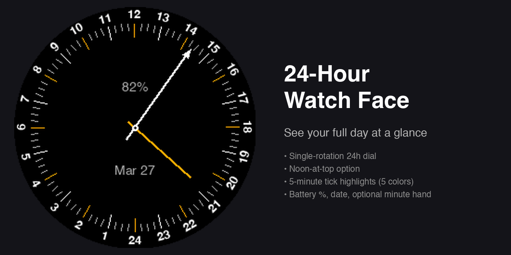
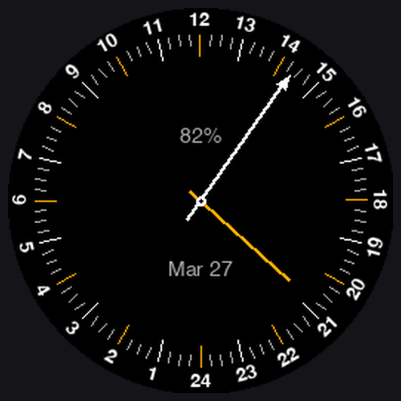

# 24-Hour Watch Face for Garmin

A minimalist 24-hour analog watch face for Garmin watches. The single hour hand completes one full rotation per day, giving you an intuitive sense of where you are in your day — morning, afternoon, and night — at a glance.

**[Install from the Connect IQ Store →](https://apps.garmin.com/apps/143cd37d-d146-4e4c-a2c8-7bfd7b418cbe)**

Inspired by the [Spokes Worldtime](https://apps.garmin.cn/zh-CN/apps/ada4fbf3-9a8b-49f1-b086-466f4215c646) watch face.

## Screenshots

| Classic (10:27 AM) | Noon-at-top + orange (4:45 PM) | Minimalist + low battery (10:10 PM) |
|:---:|:---:|:---:|
|  |  |  |

### Simulator



### Store Assets

| Banner (1440×720) | Cover (500×500) |
|:---:|:---:|
|  |  |

## Features

- **24-hour dial**: 24 at top (midnight), 6 at right, 12 at bottom, 18 at left (clockwise)
- **Hour number labels** — choose Rotated (top half upright, bottom half flipped so it reads from below), Upright (all labels horizontal), or Off (no labels, ticks only)
- **Hour and quarter-hour tick marks**
- **Hour hand** with arrowhead for precise time reading
- **Noon-at-top option** — flip the dial so 12 sits at the top instead of 24
- **5-minute tick highlights** — color the every-5-minute marks (Yellow / Red / Green / Blue / Orange) for quick minute reading; the minute hand picks up the same color
- **Minute marks** — optional inner ring of 60 dots aligned to the minute hand, for 1-minute reading precision
- **Battery percentage** — optional readout above the dial center, color-coded yellow ≤25% and red ≤10%
- **Optional minute hand** (toggle in settings)
- **Optional date display** (toggle in settings)

### What's new in v3

- Hour number style: Rotated / Upright / Off
- Optional 60-dot minute mark ring for 1-minute reading precision

### What's new in v2

- Noon-at-top dial orientation
- Color-highlighted 5-minute tick marks with matching minute hand
- Battery % readout

## Connect IQ Store Listing

Short tagline:

> A clean 24-hour analog watch face — see your full day at a glance.

Full description:

> A minimalist 24-hour analog watch face inspired by world-time and pilot watches. The single hour hand completes one full rotation per day, giving you an intuitive sense of where you are in your day — morning, afternoon, and night — at a glance.
>
> Features:
>
> • 24-hour dial — choose 24 at top (midnight) or 12 at top (noon)
> • Hour number style — Rotated (top half upright, bottom half flipped), Upright (all horizontal), or Off (ticks only)
> • Hour and quarter-hour tick marks, with optional 5-minute tick highlights in Yellow, Red, Green, Blue, or Orange — the minute hand picks up the same color
> • Optional 60-dot minute mark ring for 1-minute reading precision
> • Hour hand with arrowhead for precise time reading
> • Optional minute hand
> • Optional date display
> • Optional battery percentage, color-coded yellow at 25% or below and red at 10% or below
>
> Settings (via Garmin Connect Mobile):
>
> • Noon at top (12 at top instead of 24)
> • Hour number style (Rotated / Upright / Off)
> • 5-minute tick highlight color
> • Show/hide minute marks (60-dot ring)
> • Show/hide minute hand
> • Show/hide date
> • Show/hide battery %

Per-version release notes (v3.0.0):

> • Hour number style: Rotated / Upright / Off
> • Optional 60-dot minute mark ring for 1-minute reading precision

Per-version release notes (v2.0.0):

> • Noon-at-top dial option (12 at top instead of 24)
> • Color-highlighted 5-minute tick marks with matching minute hand
> • Battery % readout with low-battery color coding

## Supported Devices

Forerunner 255/265/945/955/965, fēnix 7/7S/7X/7 Pro/7S Pro/7X Pro, fēnix 8 (AMOLED & Solar), epix (Gen 2) / epix Pro, Venu 2/2S/2 Plus/3/3S, vívoactive 5, and more.

## Install

### From the Connect IQ Store (recommended)

Install directly from your phone via the [Connect IQ Store listing](https://apps.garmin.com/apps/143cd37d-d146-4e4c-a2c8-7bfd7b418cbe).

### Sideload

1. Build the release package (see below) or use the pre-built `bin/TwentyFourHour.iq`
2. Connect your watch via USB
3. Copy `TwentyFourHour.iq` to the `GARMIN/Apps/` folder
4. Eject — the watch face will appear in your watch face list

## Build

Prerequisites:

- [Garmin Connect IQ SDK](https://developer.garmin.com/connect-iq/sdk/) (the SDK path is the `SDK_DIR` env var below)
- [1Password CLI](https://developer.1password.com/docs/cli/) (`brew install 1password-cli`), signed in (`op signin`)
- A Connect IQ developer key stored in 1Password (one-time setup below)

The Connect IQ store enforces that every version of an app be signed with the **same** developer key. This project keeps that key in 1Password and fetches it at build time via `op read`, so the path-to-key isn't baked into the repo.

### One-time: stash the developer key in 1Password

Create a Password item whose `password` field holds the base64-encoded key:

```bash
op item create --category=password \
  --title='garmin-developer-key' --vault=Private \
  "password[concealed]=$(base64 -i /path/to/developer_key)"
```

The default reference both build scripts read is `op://Private/garmin-developer-key/password`. Override with the `KEY_REF` env var if you put it elsewhere.

### Building

```bash
./build.sh                 # Release .iq for every device in manifest.xml (sign + ship)
./build.sh --debug         # Debug .prg for fr955 (load into the simulator)
```

The script writes to `bin/TwentyFourHour.iq` (or `.prg`). It fetches the key into a temp file that's deleted on exit, so the raw key never lingers on disk.

### Manual build (without the script)

```bash
SDK_DIR="$HOME/Library/Application Support/Garmin/ConnectIQ/Sdks/connectiq-sdk-mac-8.1.1-2025-03-27-66dae750f"
KEY=$(mktemp) && trap 'rm -f "$KEY"' EXIT
op read "op://Private/garmin-developer-key/password" | base64 -d > "$KEY"

# Release .iq
"$SDK_DIR/bin/monkeyc" -o bin/TwentyFourHour.iq -f monkey.jungle -y "$KEY" -e -r

# Or debug .prg for the simulator
"$SDK_DIR/bin/monkeyc" -o bin/TwentyFourHour.prg -f monkey.jungle -y "$KEY" -d fr955
```

## Run in Simulator

```bash
# Launch the simulator
"$SDK_DIR/bin/ConnectIQ.app/Contents/MacOS/simulator" &
sleep 8

# Load the watch face
"$SDK_DIR/bin/monkeydo" bin/TwentyFourHour.prg fr955
```

Automated screenshot capture:

```bash
./screenshot.sh                   # Full pipeline: build → simulator → screenshot
./screenshot.sh --capture-only    # Just capture (simulator already running)
```

## How It Works

### Dial Drawing

All drawing is custom in `onUpdate()`. The dial is drawn from the outside in:

1. **Number bitmaps** (outermost): 24 pre-rotated PNG images via `dc.drawBitmap()`
2. **Tick marks**: `dc.drawLine()` — hour ticks 14px, quarter ticks 7px
3. **Hands**: Hour hand with arrowhead, optional minute hand

### 24-Hour Math

- Each hour = 15° (360° / 24h)
- Midnight (24/0) at top = -90° offset in standard trig
- Angle: `angleDeg = (hour * 15.0) - 90.0`

### Rotated Number Bitmaps

Connect IQ doesn't support rotated text, so each hour number is pre-rendered as a rotated PNG using Python/Pillow:

```bash
python3 generate_numbers.py    # Requires: pip3 install Pillow
```

- Font: Helvetica Bold, 13pt
- Rotated set, top half (18→6): radially oriented, readable from outside
- Rotated set, bottom half (7→17): flipped 180°, readable from below
- Upright set: no rotation, shared between standard and noon-at-top orientations

## Project Structure

```
├── source/
│   ├── TwentyFourHourApp.mc        # App entry point
│   └── TwentyFourHourView.mc       # Watch face drawing logic
├── resources/
│   ├── drawables/numbers/           # 24 standard + 24 noon-at-top + 24 upright bitmaps
│   ├── settings/                    # ShowMinuteHand, ShowDate, ShowBattery, NoonAtTop, FiveMinTickColor, TickLabelStyle, ShowMinuteMarks
│   └── strings/                     # App name, setting titles
├── generate_numbers.py              # Regenerate rotated number bitmaps
├── generate_screen_images.py        # Generate store screen images
├── generate_store_images.py         # Generate store banner & cover
├── screenshot.sh                    # Build + simulator screenshot capture
└── manifest.xml                     # Supported devices & permissions
```

## License

MIT
